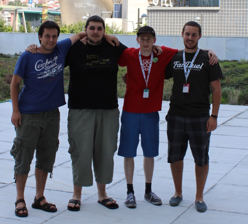

# PyJokes Society

Founders:

- [Ben Nuttall](https://twitter.com/ben_nuttall) - Chairperson
- [Alex Savio](https://twitter.com/alex_savio) - Vice-chairperson
- [Borja Ayerdi](https://twitter.com/bayerdi) - Treasurer
- [Oier Echaniz Beneitez](https://twitter.com/oiertwo) - Spokesperson

## Oier Echaniz Beneitez

Oier co-founded PyJokes and the PyJokes Society - serving as spokesperson for six years - until he
passed away in 2020 following a long-term illness.

He was one of the most enthusiastic and engaged members of the Python community, organising
conferences PySS in San Sebastian, and EuroPython in Bilbao.

A tribute was published by the EuroPython Society: [europython-society.org/farewell-to-oier-echaniz-beneitez](https://www.europython-society.org/farewell-to-oier-echaniz-beneitez)

**Our good friend: We'll miss you!**

May the good vibes and pyntxos always be with you.